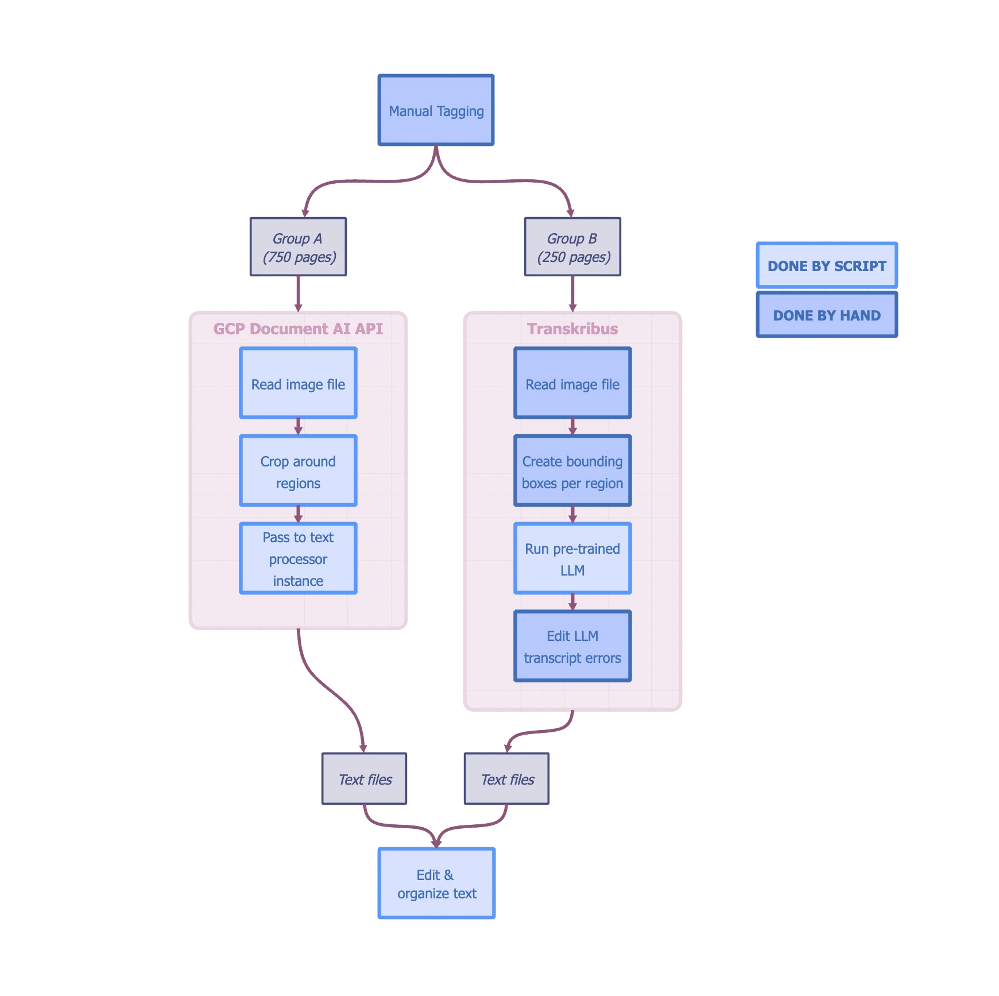

# Fraktur German/Peter Kolb transcription project

This repo contains code and output from my project at Stanford Center for Spatial and Textual Analysis (CESTA). The project consisted of transcribing German explorer Peter Kolb (or Kolbe)'s 1719 book on the Cape of Good Hope from scanned images to machine-readable and editiable text files. Versions of these files are in the `output-txt` folder. 

### Key Resources

* The anthology article (more detailed & aesthetic than GitHub) written by Sam about his work can be found at [cesta-io.stanford.edu](https://cesta-io.stanford.edu/anthology/2024-research-anthology/early-cape-travelers/)
* Source files for the book can be found at [interntarchive.org](https://archive.org/details/bub_gb_MbxYAAAAcAAJ)
* Source files of the archival texts used to build a historical German corpus for the spell checker: [DTA normalized/plaintext corpus 1600-1699](https://www.deutschestextarchiv.de/download#:~:text=b9a03d116c244c2da30ccc0937cc9c87-,normalized,-package), [DTA normalized/plaintext corpus 1700-1799](https://www.deutschestextarchiv.de/download#:~:text=b9a03d116c244c2da30ccc0937cc9c87-,normalized,-package), [CLARIN GeMiCorpus 1500-1700](https://llds.ling-phil.ox.ac.uk/llds/xmlui/handle/20.500.14106/2562)
* Guidance on using GCP Document AI can be found here: [product guide](https://cloud.google.com/document-ai), [scripting guide](https://github.com/GoogleCloudPlatform/python-docs-samples/tree/main/documentai/snippets), [enterprise OCR overview](https://cloud.google.com/document-ai/docs/enterprise-document-ocr)

## Summary

In this project I was tasked with taking Kolb's 1719 book --the most-thorough and cited of its kind in being a primary source of the experiences and perspectives of early European explorers and settlers in the Cape of Good Hope, from scanned images of the original print into textual files that would be compatible with modern research and, specificially, digital humanities methods. This presented the need for having the text in machine-readable form.

### Text Extraction 
The two main challenges brought by the book were: 
1. understanding early-modern Fraktur German writing,
2. recognizing the reading order between columns and headers.

Most of the readily-accessible tools I explored still came up short in some way:
| Tool  | Issues |
|-------|-------|
| ABBYY FineReader, Google Docs, Adobe Acrobat | failed to recognize different column regions           |
| Transkribus | too time-consuming if using on the whole book                                           |
| Gemini, Chat-GPT-4o, trOCR, Claude| unreliable generation if untrained, too time-consuming if trained |
| Tesseract, PyMuPDF | lacked language training for Fraktur German                                      |

The focus of my task, and purpose of the larger Early Cape Travelers research project, was not to develop high accurary text tools but rather produce the best possible version of this book within my internship time, and this informed the tools I ended up going with (GCP Document AI and Transkribus).

My process for text extraction is visualized below, where the deciding factor between being tagged as Group A vs Group B was how systematically I could code-up coordinates to crop the text regions. 

  

### Text Cleaning

Next, I moved into post-processing the extracted text with a handful of NLP open-source software. After smaller corrections, I faced the need to spell check the 550k words in the corpus. I found that all other spell checking tools seemed to not handle the historical vocabulary, I ended up creating and feeding my own dictionary of German words from 1500-1800 to PySpellChecker.

Finally, I was able to bring all text, images, and tables together into a Docx document that is readable, editable, and searchable for specific content depending on the research goals. In the `output-txt` folder there is also the plain text files for every page.

## Script pipeline

Below you find the order in which I utilized the scripts in this repo during my text processing pipeline.

1. `text-extraction\jpeg_conversion.py`
   * convert jp2 files (from Internet Archive) into JPEG
2. `text-extraction\extraction_gcp.py`
   * run the GCP processor on the ‘main’ page group JPEG; save the txt files
3. `text-extraction\pdf_splitter.py`
   * create subset PDF for each page group, process on Transkribus
5. `text-extraction\jpeg_duplicator.py`
   * copy JPEGs into folder for each page group, process on Transkribus
7. `text-processing\reindex_txt_names.py`
   * rename Transkribus-exported groups to be 1-indexed (not 0-indexed)
9. `text-processing\pp_maingroup.py`
   * post-process the ‘main’ page group with level 1 and level 2
11. `text-processing\pp_index.py`
    * post-process the ‘index’ page group in three levels (basic, non-special, specials)
13. `text-processing\pp-othergroups.py`
    * post-process all other page groups in two levels (line numbers, correct lines)
    * do each page group at a time; customize script paths
15. `text-correction\unhyphenate.py`
    * unhyphenate txt files as prep for running spellchecker
17. `text-correction\spellchecker.py`
    * run spellchecker program
    * run one of the corpus creation options first (to feed the spell checker)
    * once a corpus exists, run a spellchecker option with either hard-coded or fed input/output paths
19. `text-processing\page_order_mapmaker.py`
    * create a mapping file for each page group
21. `text-processing\page_order_mapreader.py`
    * read each mapping file and copy each page group into a single ‘merged’ folder
23. `text-compilation\create_docx.py`
    * create simple/format versions of compiled Docx for each non-blank page
25. `text-correction\manual_check.py`
    * optionally, run a manual review on unknown words
27. `text-compilation\manualcheck_update.py`
    * optionally, update the list of unknown words after a manual review
29. `text-correction\manualcheck_corpus.py`
    * optionally, run a manual review on the list of corpus words
    * this script auto-updates, thus no need for separate update script
   

## Page Group Breakdown
If interested in knowing what pages I group with what, below see the page numbers for each group. These page numbers are based on their PDF page number from the source PDF.

For example, the first page of the book has page number 1 (not 0), it would belong to the "pg_img-new" list from below, and its txt file would be 01.txt. Except that page is a pure image page with no text, so there was not a txt file created for it. 

Note that the page group "main" would consist of every page NOT in one of the lists below. 
~~~
group_lists = {
    "pg_begin": [i for i in range(9, 23)],
    "pg_toc": [23, 24, 25, 26, 27],
    "pg_starts": [29, 31, 32, 36, 46, 55, 56, 68, 86, 105, 121, 136, 151, 165, 212, 231, 256, 270, 281, 304, 317, 330, 341, 347, 364, 391, 409, 420, 444, 450, 482, 488, 500, 509, 516, 528, 543, 554, 562, 579, 586, 606, 621, 629, 634, 644, 653, 666, 683, 727, 728, 729, 735, 744, 760, 798, 807, 817, 830, 840, 849, 855, 863, 873, 881, 887, 904],
    "pg_tables": [404, 405, 406, 407, 408],
    "pg_index": [i for i in range(905, 985)],
    "pg_other": [706, 874],
    "pg_dict": [985, 986],
    "pg_skip": [58],
    "pg_img": [8, 76, 140, 170, 177, 192, 201, 210, 218, 236, 240, 456, 473, 491, 519, 523, 529, 557, 569, 576, 590, 600, 626, 647, 718],
    "pg_img-new": [1, 2, 5, 8, 76, 140, 170, 177, 192, 201, 210, 218, 236, 240, 456, 473, 491, 519, 523, 529, 557, 569, 576, 590, 600, 626, 647, 718],
    "pg_blank1": [i for i in range(1, 8)],
    "pg_blank2": [10, 18, 28, 77, 141, 171, 176, 193, 200, 211, 219, 237, 241, 474, 492, 520, 524, 530, 558, 570, 575, 589, 599, 625, 648, 719, 987, 988, 989, 990, 991, 992]
}
~~~

## Spellchecker Options
The spellchecker has verious terminal command options when run. The user can select a combination of the following features for their spellchecker:

* use hard-coded list of files being spellchecked, or provide your own list
* create a brand new word list/frequency dict or use the pre-exiting one
* use a word list or frequency dict as the corpus for the spellchecker (`word_frequency.load_words(data)` vs `word_frequency.load_json(data)` in the PySpellChecker API)
* include or exclude the CLARIN archival data set (given their origin is medical context which might be deemed not relevant to the book contents)
* save or not save the frequency dict created (if not using a pre-existing)

I have included a snapshot of the relevant code to help visualize this part of the program.
~~~
if path_choice == "y":
    txt_folder = '/Users/samxp/Documents/CESTA-Summer/output-txt/from-transkribus/index/pp1-merged'
    txt_folder_save = '/Users/samxp/Documents/CESTA-Summer/output-txt/from-transkribus/index/pp2-merged-pyspck'
elif path_choice == "n":
    txt_folder = input("Enter path for folder of txt files: ")
    txt_folder_save = input("Enter path to folder for saving: ")

select = int(run_choice)
corpus_path = corpus_path_r # optional, use manually-updated corpus list rather than code-produced one  
if select == 1:
    # Load the corpus/freq, NO CLARIN DATA
    word_list = load_corpus(corpus_path)
    word_freq = load_freq(freq_path)
elif select == 2:
    # Load the corpus/freq, YES CLARIN DATA
    word_list = load_corpus(corpus_path)
    word_freq = load_freq(freq_path, load_clarin=True)
elif select == 3:
    # Load corpus + Update freq, CHECK CLARIN DATA
    word_list = load_corpus(corpus_path)
    word_freq = load_freq(freq_path, load_clarin=True, upd_corpus=word_list, save_update=False)
elif select == 4:
    # Create + Load corpus ONLY
    load_and_preprocess_files(directories, corpus_path, freq_path, save_freq=False)
    word_list = load_corpus(corpus_path)
elif select == 5:
    # Create + Load corpus/freq, CHECK CLARIN DATA
    load_and_preprocess_files(directories, corpus_path, freq_path, save_freq=True)
    word_list = load_corpus(corpus_path)
    word_freq = load_freq(freq_path, load_clarin=True)
~~~

## Recommended Next Steps
* Run the manual check program with a German-speaker to vet unknown words and then run the updating version of the script.
* Continue expanding the corpus collection to add to the three file sets used.

#### Warnings
* Some pages that hold illustrations also contain some minor text, serving as descriptor of the illustration. However, of these pages, only page 17 (0017.txt) was run through the text extraction process (and oversight on my part). Future versions of this project should process all pages in the "pg_img-new" group that also have text.
* The source file from Internet Archive is **NOT** complete. There is missing content around page number 57-59, as seen by how the printed page numbers at the top of the page margins do not line up in sequence. In my work I decided to skip page 58.

## Author
Feel free to contact me by Github [@samprietoserrano](https://www.github.com/samprietoserrano), [Email](mailto:samprieto@outlook.com), or [LinkedIn/SamPrietoSerrano](http://www.linkedin.com/in/samprietoserrano).

